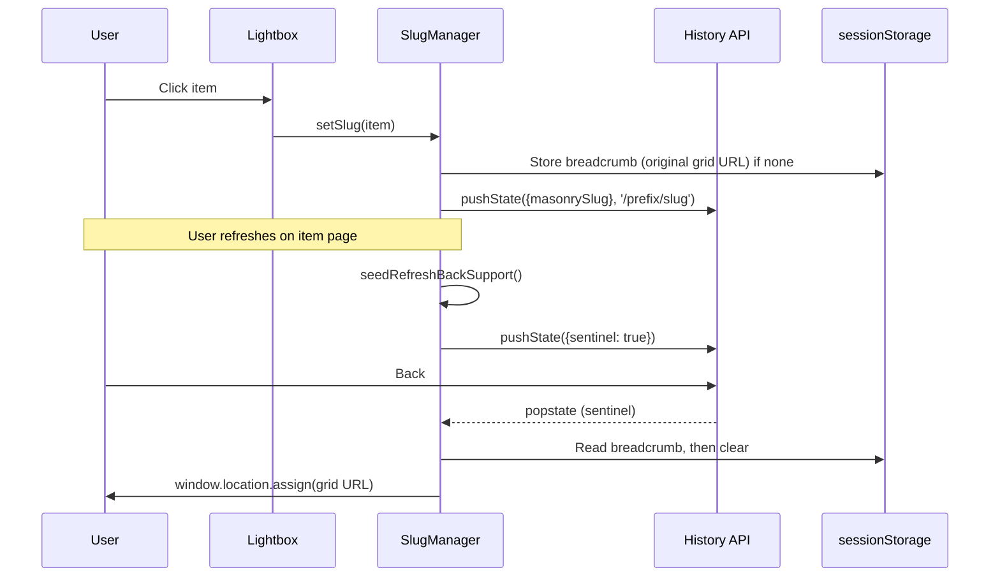

## Masonry Lightbox Slugs: Deep Linking, Refresh → Back, and History Behavior

This document explains how the slug-based deep-linking works for the Masonry Lightbox, why the refresh → back behavior needed special handling, and how the current approach solves it without breaking normal SPA-style navigation.

### TL;DR
- Opening a lightbox item updates the URL to a pretty, shareable path like `/banana/12345` via `history.pushState`.
- We drop a one-time “breadcrumb” (the original grid URL) into `sessionStorage` when the user opens an item.
- If the user refreshes while on the item page, we seed a single “sentinel” history entry so that the very next Back reliably returns them to the grid page.
- No query params, no URL pollution, and normal Back/Forward behavior remains intact.

---

### Why this approach works

Browsers typically discard the pre-refresh session history of the current tab when you hard refresh on a deep-linked page. That means if you land on `/banana/12345` and press refresh, the tab’s history often contains only that single entry. Pressing Back appears to “do nothing,” because there’s nowhere to go.

We fix this with two small pieces of state:

- A breadcrumb (stored in `sessionStorage`) remembering the original grid URL. It persists across refresh within the same tab.
- A sentinel history entry (pushed via `history.pushState`) created only after a refresh on an item page. On the first Back after that refresh, the sentinel allows us to intercept Back and navigate to the stored grid URL exactly once.

Critically, this behavior only kicks in on the “refreshed deep-link” case. Normal SPA back/forward behavior remains unchanged:

- Open/close lightbox without reload: unchanged; we push/pop history as before.
- Navigate Back/Forward between previously opened items: unchanged.
- Hard refresh on an item page: we seed a single entry so Back returns to the grid page, then clear that breadcrumb and get out of the way.

No query params or forced reloads are used during standard interactions; we keep URLs pretty and avoid breaking caching/sharing.

---

### Concepts and primitives

- Breadcrumb key: `sessionStorage['masonryOriginalUrl']`
- Sentinel flag: a dummy `history.pushState({ masonryReturnSentinel: true }, ...)` entry created after detecting a refresh.
- Same-origin safety: any redirect based on the breadcrumb is only performed if the stored URL is same-origin.

---

### How it works (step-by-step)

1) User opens a lightbox item
- The Lightbox calls `SlugManager.setSlug(item)`.
- If this is user-initiated (not during a `popstate`), we store the page URL we are leaving (breadcrumb) into `sessionStorage` under `masonryOriginalUrl`.
- We then `pushState({ masonrySlug, originalUrl }, '', '/<prefix>/<slug>')` without reloading. The address bar shows the pretty path.

2) User refreshes on the item page
- On page load, `SlugManager.seedRefreshBackSupport()` runs once.
- If a breadcrumb exists AND we detect a reload (via `performance.getEntriesByType('navigation')` or legacy `performance.navigation.type`), we create a single sentinel entry using `history.pushState`.
- We attach a one-time `popstate` listener. On the first Back, we read the breadcrumb and navigate to it via `window.location.assign(url)`, then remove the breadcrumb.

3) Normal Back/Forward
- If `popstate` carries a `masonrySlug`, the lightbox opens the matching item without pushing new history entries.
- If `popstate` carries no slug, we close the lightbox (if open) and clear the breadcrumb (since we are back on the grid), preserving standard SPA behavior.

---

### Technical details (code references)

- File: `modules/lightbox/slugs.js`
  - `SlugManager.setSlug(item)`: stores breadcrumb for user-initiated opens and pushes a new history state with the pretty URL.
  - `SlugManager.handlePopState(event)`: opens/closes the lightbox based on `event.state.masonrySlug`; clears the breadcrumb when returning to the grid.
  - `SlugManager.seedRefreshBackSupport()`: if we detect a reload on an item page and a breadcrumb exists, push a sentinel entry and intercept the first Back to return to the stored grid URL.
  - Safety helpers: `safeSameOrigin(url)` ensures we never navigate outside the current origin; `isReloadNavigation()` detects reload using modern and legacy Performance APIs.

---

### Data-attributes and configuration

Enable slug support on your masonry container:

```html
<div
  data-masonry="grid"
  data-masonry-enable-slug="true"
  data-masonry-slug-prefix="banana"
>
  <div data-masonry-slug="12345"> ... </div>
  <div data-masonry-slug="98765"> ... </div>
  <!-- more items... -->
</div>
```

- `data-masonry-enable-slug="true"`: turns on slug behavior.
- `data-masonry-slug-prefix`: the path prefix added before the slug value (`/banana/12345`). Optional; if omitted, the URL is `/<slug>`.
- `data-masonry-slug`: per-item unique slug value. Each item should have a unique, non-empty value.

The attribute names come from `SLUG_CONFIG` in `modules/lightbox/config.js`:

- Enabled: `masonry-enable-slug` → `data-masonry-enable-slug="true"`
- Prefix: `masonry-slug-prefix` → `data-masonry-slug-prefix="..."`
- Value: `masonry-slug` → `data-masonry-slug="..."`

---

### Initialization and bootstrapping

- Lightbox integration: The lightbox plugin creates a `SlugManager` for each masonry container and attaches popstate handling so Back/Forward opens/closes items.
- Global bootstrap: `masonry.js` calls `SlugManager.seedRefreshBackSupport()` once per page load so that “refresh on item page → back to grid” works even on templates that may not initialize a masonry instance.

Nothing else is required. Ensure the script is loaded on both the grid page and the individual item template page.

---

### Event flow (sequence)



---

### Debugging

- All logs are prefixed with `🔗 Slugs:` in the console.
- You should see messages when breadcrumbs are stored/cleared, when sentinel is seeded, and when Back is intercepted.
- Inspect `sessionStorage['masonryOriginalUrl']` to confirm the breadcrumb is present before refresh and cleared after returning to the grid.
- Use the browser’s Network/Performance panels to observe that standard navigation remains SPA-style (no hard navigations) during normal open/close/back/forward.

Common pitfalls
- Missing attributes: If `data-masonry-enable-slug="true"` or `data-masonry-slug` are missing, deep-linking won’t activate. The `validateConfiguration()` helper will log warnings.
- Duplicate slugs: Each item should have a unique `data-masonry-slug` value. Duplicates lead to ambiguous navigation when using Back/Forward.
- Cross-origin redirects: Breadcrumbs are only honored if same-origin; otherwise they’re ignored for safety.
- Not loaded on template pages: Load the script bundle wherever an item page can be refreshed so seeding can run.

---

### API surface (selected)

- `SlugManager.setSlug(item)`: Pushes pretty URL; stores breadcrumb if user-initiated.
- `SlugManager.clearSlug()`: Requests a history Back (unless handling popstate) and dispatches a `masonry:slugCleared` event.
- `SlugManager.attachLightbox(lightbox) / detachLightbox()`: Binds/unbinds `popstate` handling.
- `SlugManager.handlePopState(evt)`: Opens/closes items based on state; clears breadcrumb upon returning to grid.
- `SlugManager.seedRefreshBackSupport()`: One-time bootstrap, used after a reload on an item page to enable Back → grid.
- `SlugManager.validateConfiguration()`: Logs configuration issues to the console.

All methods live in `modules/lightbox/slugs.js`.

---

### Rationale vs. alternatives

- Query-param approach (e.g., `?from=`/`?lightbox=true`) pollutes URLs and can break caching and sharing. We avoid it.
- Forcing full navigations inside `popstate` breaks SPA behavior; we only do a hard navigation once for the refresh→back sentinel case.
- Using `replaceState` to “clean up” URLs after param injection is unnecessary with the breadcrumb + sentinel pattern.

This design preserves the original, clean History API usage while reliably supporting the refresh→back flow.

---

### Edge cases and notes

- Multiple grids per page: Breadcrumb stores the page URL, not a specific grid. The first Back after refresh returns to the page you came from, which is the correct user expectation.
- SSR/static hosting: Pretty paths like `/banana/12345` should resolve to your item template. The slug system assumes that direct loads of item URLs are valid in your environment.
- Browser differences: Reload detection uses modern `PerformanceNavigationTiming` and falls back to legacy `performance.navigation.type` when necessary.
- Security: Only same-origin breadcrumbs are honored (defense-in-depth in case of storage tampering).

---

### Versioning and maintenance

The slug system is encapsulated in `SlugManager`. It is used internally by the lightbox plugin and also provides a static bootstrap for refresh→back support. Future enhancements (e.g., SSR hints, analytics hooks) can be layered without changing the core behavior described here.


